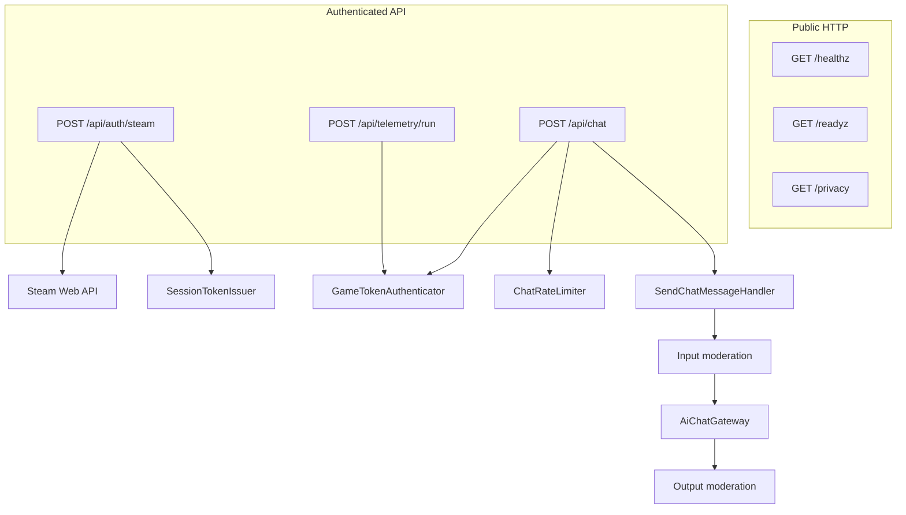

# Backend Architecture

Symfony 8 / PHP 8.4 backend for Loop 9 Steam auth, AI chat, quotas, moderation, and run telemetry.

Hexagonal / DDD-lite layout:

| Layer | Path | Responsibility |
|---|---|---|
| Domain | `src/Domain` | Pure policies, value objects, validators |
| Application | `src/Application` | Use-case handlers (`SendChatMessageHandler`) |
| Infrastructure | `src/Infrastructure` | HTTP, AI transport, auth, Redis-backed limits |
| Shared | `src/Shared` | CORS, JSON error envelope |
| Prompts | `config/prompts` | Externalized system prompts |

## Request pipelines

## Chat use-case

`SendChatMessageHandler`:

1. Local + OpenAI moderation on input (fail-closed)
2. Prompt assembly (`PromptFactory` + compact/full system prompts)
3. Provider cascade (`AiChatGateway`, 45s total deadline)
4. Assistant reply format validation (`[STATE]KINDNESS=...;SUSPICION=...`)
5. Output moderation (fail-closed)
6. Safe localized fallbacks when blocked or unusable

## Auth model

- Preferred: Steam ticket → short-lived HMAC session token → `X-Session-Token`
- Legacy/dev: shared `X-Game-Token` (forbidden when `APP_ENV=prod`)
- Player id for session auth is derived as `steam-<id64>`

## Quotas

Configured in `config/packages/rate_limiter.yaml`, enforced by `ChatRateLimiter`.

Chat order:

1. burst (`game_chat`)
2. validate body
3. IP daily
4. player daily
5. player monthly
6. global daily (last, cost kill-switch)

## Observability

- Structured JSON logs to stderr in production
- `X-Request-Id` correlation
- Timing breakdowns for auth and chat
- No logging of tickets, tokens, API keys, or chat message bodies

## Related docs

- [docs/API.md](docs/API.md)
- [docs/CONFIGURATION.md](docs/CONFIGURATION.md)
- [docs/AI_PIPELINE.md](docs/AI_PIPELINE.md)
- [docs/SECURITY_AND_PRIVACY.md](docs/SECURITY_AND_PRIVACY.md)
- [docs/OPERATIONS.md](docs/OPERATIONS.md)
- [docs/DEVELOPMENT_AND_TESTING.md](docs/DEVELOPMENT_AND_TESTING.md)
