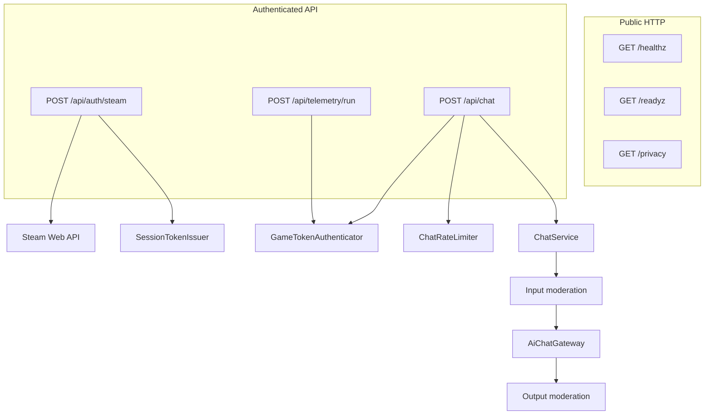

# Backend Architecture

Symfony 8 / PHP 8.4 backend for Loop 9 Steam auth, AI chat, quotas, moderation, and run telemetry.

SRWA-style hexagonal / DDD-lite layout:

| Layer | Path | Responsibility |
|---|---|---|
| Model | `src/Model` | Pure policies, value objects, validators, outbound ports |
| Application | `src/Application` | Use-case services and DTOs (`ChatService`) |
| Adapter | `src/Adapter` | HTTP, event subscribers, AI transport, Steam auth, configuration, Redis-backed limits |
| Prompts | `config/prompts` | Externalized system prompts |

Dependencies point inward: HTTP adapters call Application services, Application
depends only on Model types and ports, and concrete AI adapters implement those
ports through explicit bindings in `config/services.yaml`.

## Request pipelines

## Chat use-case

`ChatService`:

1. Local + OpenAI moderation on input (fail-closed)
2. Prompt assembly (`PromptFactory` + compact/full system prompts)
3. Provider cascade (`AiChatGateway`, 45s total deadline)
4. Assistant reply format validation (`[STATE]KINDNESS=...;SUSPICION=...`)
5. Output moderation (fail-closed)
6. Safe localized fallbacks when blocked or unusable

## Auth model

- Preferred: Steam ticket → short-lived HMAC session token → `X-Session-Token`
- Legacy/dev: shared `X-Game-Token` (forbidden when `APP_ENV=prod`)
- Player id for session auth is derived as `steam-<id64>`

## Quotas

Configured in `config/packages/rate_limiter.yaml`, enforced by `ChatRateLimiter`.

Chat order:

1. burst (`game_chat`)
2. validate body
3. IP daily
4. player daily
5. player monthly
6. global daily (last, cost kill-switch)

## Observability

- Structured JSON logs to stderr in production
- `X-Request-Id` correlation
- Timing breakdowns for auth and chat
- No logging of tickets, tokens, API keys, or chat message bodies
- Cumulative event counters in Redis, published read-only at `GET /metrics`

The counters exist because reading volume and failure rates out of a log stream means either a
log aggregator or a person with `grep`. They count the events already considered worth logging,
at the same place in the code, so a number and a log line never disagree.

`EventCounters` is a port. The Redis adapter uses `HINCRBY`, since a cache pool read-modify-write
would lose counts under concurrency, and a write failure is swallowed and logged: no player's
message fails because a counter did not increment. Where there is no Redis the counts live for
one request, which is all a single process can honestly claim — and the payload names its storage
so a reader can tell an empty answer from a forgetful one.

Token spend is counted from the usage the provider already returns on each completion, including
replies this service then discards. Asking the provider's billing API would mean holding its key
in a second place; the bill is already in the response. Cost is stored as millionths of a dollar
so an integer counter can add it up.

`PlayerPresence` is the second port, and the one number no probe can produce: a service answering
`/healthz` with nobody in it looks exactly like one carrying a thousand players. It is a level
rather than a total, so it is published as a gauge and never summed. The Redis adapter keeps a
sorted set of hashed player marks scored by last-seen second — a set because one player sending
four messages is one player, hashed because the count answers how many and never who. Marks are
written on a login, a chat message and a finished run, which is as close to "playing" as this
service can see, and marks older than a day are dropped when the set is read.

## Related docs

- [docs/API.md](docs/API.md)
- [docs/CONFIGURATION.md](docs/CONFIGURATION.md)
- [docs/AI_PIPELINE.md](docs/AI_PIPELINE.md)
- [docs/SECURITY_AND_PRIVACY.md](docs/SECURITY_AND_PRIVACY.md)
- [docs/OPERATIONS.md](docs/OPERATIONS.md)
- [docs/DEVELOPMENT_AND_TESTING.md](docs/DEVELOPMENT_AND_TESTING.md)
